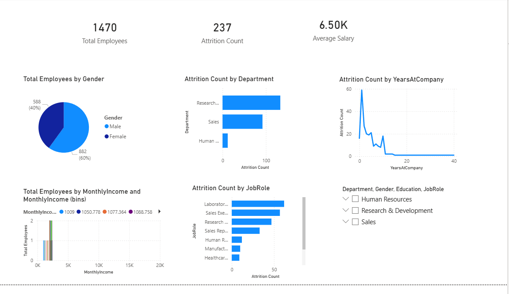

# HR Analytics Dashboard

## Project Overview
This project analyzes employee attrition trends using SQL, Python, and Power BI.

## Tools Used
- Python (Pandas)
- MySQL
- Power BI
- Excel

## Key Insights
- Sales department has highest attrition
- Employees with <2 years tenure are more likely to leave
- Lower salary range shows higher exit rate

## Dashboard Preview

